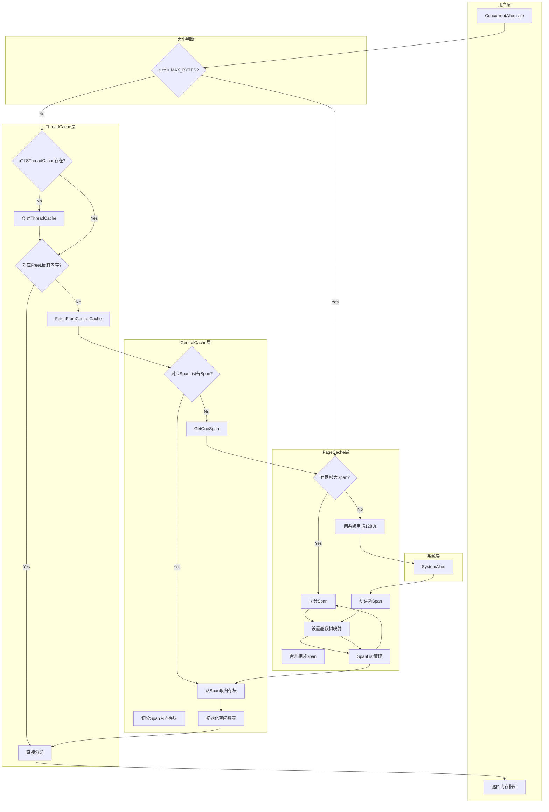
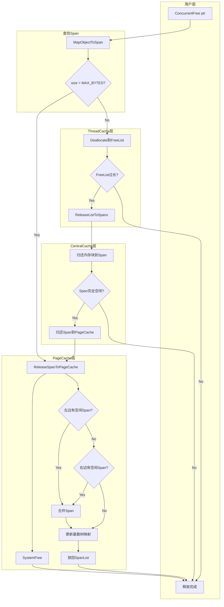
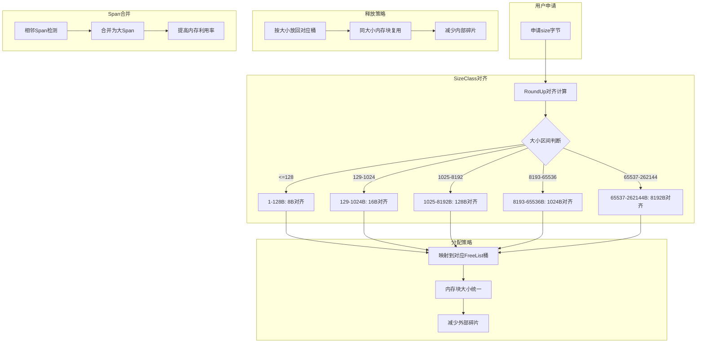

# 并发内存池 - 完整流程图

## 内存分配流程图

```mermaid
flowchart TD
    subgraph 用户层
        A[ConcurrentAlloc size]
        Z[返回内存指针]
    end
    
    subgraph 大小判断
        B{size > MAX_BYTES?}
    end
    
    subgraph ThreadCache层
        C{pTLSThreadCache存在?}
        D[创建ThreadCache]
        E{对应FreeList有内存?}
        F[直接分配]
        G[FetchFromCentralCache]
    end
    
    subgraph CentralCache层
        H{对应SpanList有Span?}
        I[从Span取内存块]
        J[GetOneSpan]
        K[切分Span为内存块]
        L[初始化空闲链表]
    end
    
    subgraph PageCache层
        M{有足够大Span?}
        N[切分Span]
        O[向系统申请128页]
        P[创建新Span]
        Q[设置基数树映射]
        R[合并相邻Span]
        S[SpanList管理]
    end
    
    subgraph 系统层
        T[SystemAlloc]
    end
    
    A --> B
    B -->|Yes| M
    B -->|No| C
    
    C -->|No| D --> E
    C -->|Yes| E
    
    E -->|Yes| F --> Z
    E -->|No| G --> H
    
    H -->|Yes| I --> L --> F
    H -->|No| J --> M
    
    M -->|Yes| N --> Q --> S --> I
    M -->|No| O --> T --> P --> Q --> S --> N
```

## 内存释放流程图

```mermaid
flowchart TD
    subgraph 用户层
        A[ConcurrentFree ptr]
        Z[释放完成]
    end
    
    subgraph 查找Span
        B[MapObjectToSpan]
        C{size > MAX_BYTES?}
    end
    
    subgraph ThreadCache层
        D[Deallocate到FreeList]
        E{FreeList过长?}
        F[ReleaseListToSpans]
    end
    
    subgraph CentralCache层
        G[归还内存块到Span]
        H{Span完全空闲?}
        I[归还Span到PageCache]
    end
    
    subgraph PageCache层
        J[ReleaseSpanToPageCache]
        K{左边有空闲Span?}
        L{右边有空闲Span?}
        M[合并Span]
        N[更新基数树映射]
        O[放回SpanList]
        P[SystemFree]
    end
    
    A --> B --> C
    
    C -->|Yes| J --> P --> Z
    C -->|No| D --> E
    
    E -->|Yes| F --> G
    E -->|No| Z
    
    G --> H
    H -->|Yes| I --> J
    H -->|No| Z
    
    J --> K
    K -->|Yes| M
    K -->|No| L
    
    L -->|Yes| M
    L -->|No| N
    
    M --> N --> O --> Z
```

## 内存对齐与碎片管理流程图

```mermaid
flowchart TD
    subgraph 用户申请
        A[申请size字节]
    end
    
    subgraph SizeClass对齐
        B[RoundUp对齐计算]
        C{大小区间判断}
        D[1-128B: 8B对齐]
        E[129-1024B: 16B对齐]
        F[1025-8192B: 128B对齐]
        G[8193-65536B: 1024B对齐]
        H[65537-262144B: 8192B对齐]
    end
    
    subgraph 分配策略
        I[映射到对应FreeList桶]
        J[内存块大小统一]
        K[减少外部碎片]
    end
    
    subgraph 释放策略
        L[按大小放回对应桶]
        M[同大小内存块复用]
        N[减少内部碎片]
    end
    
    subgraph Span合并
        O[相邻Span检测]
        P[合并为大Span]
        Q[提高内存利用率]
    end
    
    A --> B --> C
    C -->|<=128| D --> I
    C -->|129-1024| E --> I
    C -->|1025-8192| F --> I
    C -->|8193-65536| G --> I
    C -->|65537-262144| H --> I
    
    I --> J --> K
    L --> M --> N
    O --> P --> Q
```
