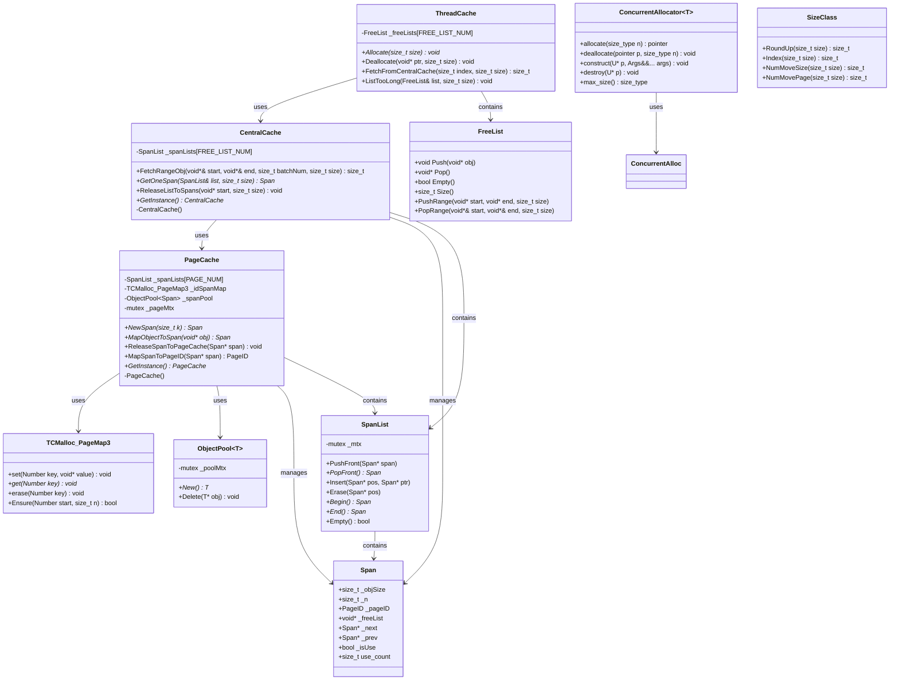

# 并发内存池 - 类图

## 类关系说明

| 关系 | 类A | 类B | 说明 |
|------|-----|-----|------|
| uses | ThreadCache | CentralCache | 线程缓存向中央缓存申请内存 |
| uses | CentralCache | PageCache | 中央缓存向页面缓存申请Span |
| uses | PageCache | TCMalloc_PageMap3 | 页面缓存使用基数树映射页号 |
| uses | PageCache | ObjectPool~Span~ | 页面缓存使用对象池管理Span |
| uses | ConcurrentAllocator | ConcurrentAlloc | 标准分配器调用并发内存池接口 |
| manages | CentralCache | Span | 中央缓存管理Span链表 |
| manages | PageCache | Span | 页面缓存管理Span链表 |
| contains | ThreadCache | FreeList | 线程缓存包含多个空闲链表 |
| contains | CentralCache | SpanList | 中央缓存包含多个Span链表 |
| contains | PageCache | SpanList | 页面缓存包含多个Span链表 |
| contains | SpanList | Span | Span链表包含Span节点 |

## 核心类职责

| 类 | 职责 |
|----|------|
| ThreadCache | 线程本地缓存，无锁分配，减少锁竞争 |
| CentralCache | 全局缓存，桶级锁，批量分配/释放 |
| PageCache | 页面级缓存，全局锁，向系统申请内存 |
| TCMalloc_PageMap3 | 三层基数树，O(1)页号到Span映射 |
| ObjectPool~Span~ | Span对象池，高效创建/销毁Span |
| ConcurrentAllocator | C++标准分配器接口，适配STL容器 |
| Span | 内存页管理单元 |
| FreeList | 空闲内存块链表 |
| SpanList | Span双向链表 |
| SizeClass | 内存大小对齐和哈希桶索引计算 |
